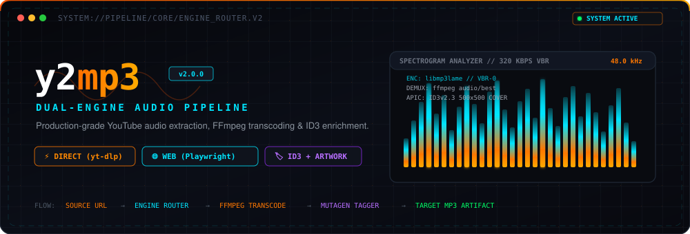
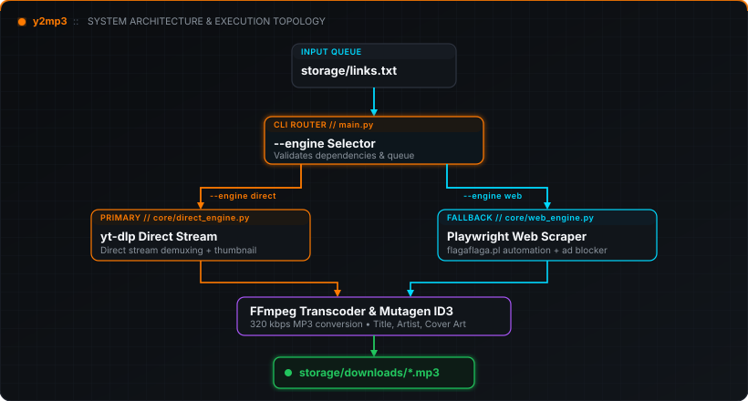

<<<<<<< HEAD
# y2mp3
An automated, high-performance Python batch pipeline to download and convert YouTube links into high-quality MP3s using yt-dlp and browser automation.
=======
<div align="center">



<br/>

[](https://python.org)
[](https://github.com/yt-dlp/yt-dlp)
[](https://playwright.dev)
[](https://ffmpeg.org)
[](https://mutagen.readthedocs.io)
[](LICENSE)

<p align="center">
  <b>A modular, batch-oriented YouTube audio extraction, transcoding, and ID3 metadata enrichment pipeline.</b><br/>
  Featuring a high-throughput direct stream engine and a headless browser automation fallback engine with popup suppression.
</p>

[Architecture](#-system-architecture) • [Data Flow](#-pipeline-data-flow) • [Engines](#-engine-deep-dive) • [Installation](#-installation--prerequisites) • [CLI Reference](#-cli-reference) • [Configuration](#-configuration-matrix) • [FAQ](#-frequently-asked-questions)

</div>

---

### 🖥️ Pipeline Architecture Status

```text
┌────────────────────────────────────────────────────────────────────────────────────────┐
│  Y2MP3 :: SYSTEM TOPOLOGY & COMPONENT MONITOR                                          │
├────────────────────────────────────────────────────────────────────────────────────────┤
│  PRIMARY ENGINE      ● DIRECT EXTRACTION   [yt-dlp // native stream demuxing]          │
│  FALLBACK ENGINE     ● WEB AUTOMATION      [playwright // chromium headless]           │
│  AUDIO TRANSCODER    ● FFMPEG              [libmp3lame // 320 kbps VBR-0 target]       │
│  METADATA MUTATOR    ● MUTAGEN             [ID3v2.3 // TIT2, TPE1, TALB, APIC artwork] │
│  QUEUE DISPATCHER    ● SEQUENTIAL BATCH    [storage/links.txt // comment-tolerant]     │
│  PERSISTENT AUDIT    ● STRUCTURED LOGS     [logs/pipeline.log // ISO timestamped]      │
│  OUTPUT TARGET       ● ARTIFACT STORAGE    [storage/downloads/*.mp3]                   │
└────────────────────────────────────────────────────────────────────────────────────────┘
```

---

## ⚡ Key Features

<table>
  <tr>
    <td width="50%" valign="top">
      <h4>⚡ Dual-Engine Extraction Core</h4>
      <ul>
        <li><b>Direct Engine (<code>yt-dlp</code>):</b> Pulls audio streams directly from source servers without scraping third-party wrapper sites.</li>
        <li><b>Web Engine (<code>Playwright</code>):</b> Headless Chromium automation targeting <code>flagaflaga.pl</code> with programmatic popup and ad-tab interception.</li>
      </ul>
    </td>
    <td width="50%" valign="top">
      <h4>🎵 Studio-Grade Audio Transcoding</h4>
      <ul>
        <li>FFmpeg post-processing utilizing <code>libmp3lame</code>.</li>
        <li>Configurable target bitrates up to <b>320 kbps</b> (default) or <b>192 kbps</b>.</li>
        <li>Clean stream extraction with post-transcode temporary file cleanup.</li>
      </ul>
    </td>
  </tr>
  <tr>
    <td width="50%" valign="top">
      <h4>🏷️ Automated ID3 & Artwork Injection</h4>
      <ul>
        <li>Uses <code>mutagen.id3</code> to inject metadata frames: Title (<code>TIT2</code>), Artist/Uploader (<code>TPE1</code>), and Album (<code>TALB</code>).</li>
        <li>Automatically embeds video thumbnails into the MP3 container as front cover art (<code>APIC</code>) and cleans up source image files.</li>
      </ul>
    </td>
    <td width="50%" valign="top">
      <h4>🛡️ Resilient Batch Execution</h4>
      <ul>
        <li>Sequential queue processing from <code>storage/links.txt</code>.</li>
        <li>Ignores whitespace and comment lines (<code>#</code>).</li>
        <li>Per-item fault isolation: network timeouts, private videos, or extraction errors are logged without halting the remaining queue.</li>
      </ul>
    </td>
  </tr>
</table>

---

## 🎯 Why y2mp3?

Traditional YouTube-to-MP3 download utilities generally suffer from one of two architectural pitfalls:

1. **Monolithic CLI wrappers:** Rely strictly on local extraction tools. When YouTube deploys rate limits, signature changes, or bot-detection heuristics, the entire pipeline crashes with no recourse.
2. **Third-party web scrapers:** Often ad-infested, unreliable, prone to sudden shutdowns, and do not embed standardized ID3 tags or high-resolution album artwork into the resulting audio container.

**y2mp3** decouples the pipeline controller from the underlying extraction mechanics:

```text
Traditional Downloader:
Source URL ──────────────────► [Downloader] ──────────────────► Output File (Often untagged)

y2mp3 Architecture:
Source URL ──► [Engine Router] ──┬──► Direct Engine (yt-dlp) ───► [FFmpeg Transcoder] ──► [Mutagen ID3 Tagging] ──► Final MP3
                                └──► Web Engine (Playwright) ──► [Ad Killer & Scraper] ───────────────────────► Final MP3
```

By presenting a unified CLI interface and standardized storage architecture, `y2mp3` delivers predictable batch performance, full metadata tagging, and transparent fallback capabilities.

---

## 🏗️ System Architecture

<div align="center">
  
</div>

```mermaid
flowchart TD
    subgraph Input ["1. Input Queue Layer"]
        L["storage/links.txt"] -->|Sequential URLs| M["main.py CLI Controller"]
    end

    subgraph Router ["2. Dispatch & Routing"]
        M -->|--engine direct| D["DirectYtdlpEngine\n(core/direct_engine.py)"]
        M -->|--engine web| W["WebFlagaEngine\n(core/web_engine.py)"]
    end

    subgraph DirectPath ["3A. Direct Stream Pipeline"]
        D -->|Demux Raw Audio| FF["FFmpeg Transcoder\n(libmp3lame 320kbps)"]
        D -->|Fetch Thumbnail| TH["Temporary Artwork\n(.jpg / .webp)"]
        FF --> MP3_RAW["Transcoded .mp3"]
        MP3_RAW & TH --> MT["Mutagen ID3v2.3 Engine\n(core/metadata.py)"]
        MT -->|Inject TIT2, TPE1, TALB, APIC| MP3_TAGGED["Tagged MP3 Artifact"]
    end

    subgraph WebPath ["3B. Web Automation Pipeline"]
        W -->|Headless Chromium| NAV["Navigate flagaflaga.pl"]
        NAV -->|Form Fill & Click Start| AD["Popup / Ad-Tab Interceptor\n(context.on('page'))"]
        AD -->|Poll HTMX State| DL_BTN["Download Button Visible"]
        DL_BTN -->|expect_download()| MP3_WEB["Direct MP3 Download"]
    end

    subgraph Output ["4. Storage & Audit"]
        MP3_TAGGED --> OUT["storage/downloads/*.mp3"]
        MP3_WEB --> OUT
        D & W -->|Diagnostic Records| LOG["logs/pipeline.log"]
    end

    classDef direct fill:#1A130B,stroke:#FF7700,stroke-width:1.5px,color:#FFF;
    classDef web fill:#081520,stroke:#00E5FF,stroke-width:1.5px,color:#FFF;
    classDef shared fill:#120E22,stroke:#A855F7,stroke-width:1.5px,color:#FFF;
    classDef storage fill:#0A1B14,stroke:#00FF66,stroke-width:1.5px,color:#FFF;

    class D,FF,MP3_RAW,MP3_TAGGED direct;
    class W,NAV,AD,DL_BTN,MP3_WEB web;
    class MT shared;
    class L,M,OUT,LOG storage;
```

---

## 🔄 Pipeline Data Flow

Every URL processed through `y2mp3` undergoes the following lifecycle:

| Step | Phase | Input | Processing Operation | Output |
|:---:|:---|:---|:---|:---|
| **01** | **Ingestion** | `storage/links.txt` | Read lines, trim whitespace, filter comments (`#`) and empty rows. | Sanitized URL Queue |
| **02** | **Pre-flight** | System Environment | Detect `ffmpeg` executable on `PATH`; verify engine dependencies. | Ready Status / Exit Flag |
| **03** | **Dispatch** | Sanitized URL | Route execution to `DirectYtdlpEngine` or `WebFlagaEngine`. | Engine Instance |
| **04A** | **Direct Demux** | Source URL | `yt-dlp` extracts audio stream; `FFmpegExtractAudio` encodes to MP3. | Transcoded `.mp3` |
| **04B** | **Web Automate** | Source URL | Playwright fills input, dismisses popups, triggers converter download. | Saved `.mp3` |
| **05** | **Enrichment** | `.mp3` + Thumbnail | `mutagen.id3` sets `TIT2`, `TPE1`, `TALB`, and front cover `APIC`. | Tagged `.mp3` |
| **06** | **Purge** | Temporary files | Intermediary `.webp`/`.jpg` thumbnails removed from disk. | Clean Storage |
| **07** | **Audit** | Result status | Timestamp, error traces, and status written to `logs/pipeline.log`. | Audit Entry |

---

## 🔬 Engine Deep Dive

### 1. Direct Engine (`DirectYtdlpEngine`)
The default, high-throughput extraction engine built on `yt-dlp` and `FFmpeg`.

* **Stream Demuxing:** Identifies the highest-fidelity available audio stream (`bestaudio/best`) without fetching video packets.
* **Transcoding:** Calls FFmpeg post-processor `FFmpegExtractAudio` with codec `mp3` and bitrate `320` kbps (VBR/CBR configurable).
* **Metadata & Cover Art:** Extracts metadata fields (`title`, `uploader`, `channel`, `album`) and fetches video thumbnails. Passes artifacts to `embed_id3_metadata()` which embeds standard ID3v2.3 tags and cover art.
* **Fault Isolation:** Catches `yt_dlp.utils.DownloadError` (network drops, bot-blocks, deleted videos) and `PostProcessingError` (corrupted streams) on a per-URL basis.

### 2. Web Automation Engine (`WebFlagaEngine`)
A fallback browser automation engine built on Playwright `sync_api` targeting `https://flagaflaga.pl/`.

* **Headless Chromium:** Launches isolated browser contexts with automation flags masked (`--disable-blink-features=AutomationControlled`).
* **Active Popup Suppression:** Listens to `context.on("page")` events. Any auxiliary advertisement windows or popunders opened by third-party ad networks are closed immediately before they can execute scripts.
* **State Machine:** Types the target URL into `input[placeholder*="Paste link"]`, clicks `button[type="submit"]` ("Start"), and polls for the resolved download button generated by the site's HTMX backend.
* **Stream Capture:** Uses Playwright's `expect_download()` context manager to intercept the server's binary payload and write it directly into `storage/downloads/`.

---

## 📊 Engine Comparison Matrix

| Technical Metric | Direct Engine (`DirectYtdlpEngine`) | Web Automation Engine (`WebFlagaEngine`) |
|:---|:---|:---|
| **Extraction Protocol** | Direct streaming API (`yt-dlp`) | Headless DOM automation (`Playwright`) |
| **Target Service** | YouTube Source CDN | `https://flagaflaga.pl/` |
| **Max Audio Quality** | Configured `320 kbps` (libmp3lame) | Service-dependent (~128–192 kbps) |
| **ID3 Metadata Embedding** | Full (Title, Artist, Album via Mutagen) | Standard file tags from remote server |
| **Album Artwork Injection** | Automatic Front Cover (`APIC` frame) | Not supported by web scraper |
| **External Binaries** | `ffmpeg` on system `PATH` | Chromium browser binaries |
| **Ad / Popunder Mitigation**| Native (No browser / no advertisements) | Event-driven window interception |
| **Throughput** | High (Direct network transfer) | Moderate (DOM rendering + remote queue) |
| **Best Used When** | Primary batch runs, highest fidelity | Circumventing local IP or network restrictions |

---

## 🏷️ Metadata Pipeline Specification

When running under `DirectYtdlpEngine`, audio files are enriched using `mutagen.id3` with the following frame schema:

```text
MP3 Container Header
  └── ID3v2.3 Tag Block
        ├── TIT2  : Track Title           (e.g., "Never Gonna Give You Up")
        ├── TPE1  : Lead Performer/Artist (e.g., "Rick Astley")
        ├── TALB  : Album Name            (e.g., "YouTube Downloads")
        └── APIC  : Attached Picture Frame
              ├── Encoding : UTF-8 (encoding=3)
              ├── MimeType : image/jpeg | image/png | image/webp
              ├── Picture  : Type 3 (Cover / Front)
              └── Data     : Raw binary thumbnail buffer
```

---

## ⚙️ Installation & Prerequisites

### 1. System Dependencies

#### FFmpeg (Required for Direct Engine)
Ensure `ffmpeg` is accessible in your system `PATH`:

```bash
# macOS (Homebrew)
brew install ffmpeg

# Ubuntu / Debian
sudo apt update && sudo apt install -y ffmpeg

# Windows (winget / Chocolatey)
winget install Gyan.FFmpeg
# or: choco install ffmpeg
```

Verify installation:
```bash
ffmpeg -version
```

---

### 2. Python Environment Setup

```bash
# 1. Clone repository
git clone https://github.com/Tejzraj/y2mp3.git
cd y2mp3

# 2. Enter application directory
cd youtube_mp3_pipeline

# 3. Create virtual environment
python3 -m venv venv
source venv/bin/activate       # On Windows: .\venv\Scripts\activate

# 4. Install dependencies
pip install -r requirements.txt

# 5. Install Playwright browser binaries (for Web Engine)
playwright install chromium
```

---

## 🚀 Quick Start (5 Steps)

```bash
# Step 1: Navigate to pipeline directory
cd youtube_mp3_pipeline

# Step 2: Populate links in storage/links.txt
echo "https://www.youtube.com/watch?v=bM7SZ5SBzyY" > storage/links.txt

# Step 3: Run with the primary Direct Engine
python main.py --engine direct

# Step 4: (Alternative) Run with Web Automation Engine
python main.py --engine web

# Step 5: Verify downloaded MP3s
ls -l storage/downloads/
```

---

## 🖥️ CLI Reference

The CLI entrypoint is `youtube_mp3_pipeline/main.py`:

```bash
python main.py [-h] [--engine {direct,web}] [--links LINKS] [--output OUTPUT]
```

### Argument Flags

| Flag | Short | Type | Default | Description | Example |
|:---|:---:|:---:|:---|:---|:---|
| `--engine` | `-e` | `str` | `direct` | Selection between `direct` (yt-dlp) and `web` (Playwright). | `python main.py -e direct` |
| `--links` | `-l` | `Path`| `storage/links.txt` | Path to text file containing target URLs. | `python main.py -l ./my_queue.txt` |
| `--output` | `-o` | `Path`| `storage/downloads` | Target destination directory for MP3 files. | `python main.py -o /Volumes/Media/Music` |
| `--help` | `-h` | — | — | Show argument descriptions and exit. | `python main.py --help` |

---

## 🔧 Configuration Matrix

Configuration constants reside in [`youtube_mp3_pipeline/config/settings.py`](youtube_mp3_pipeline/config/settings.py):

| Variable | Type | Default Value | Purpose |
|:---|:---:|:---|:---|
| `BASE_DIR` | `Path` | `Path(__file__).parent.parent` | Project root anchor for resolving relative paths. |
| `DOWNLOAD_DIR` | `Path` | `BASE_DIR / "storage/downloads"` | Target output directory for processed audio files. |
| `LINKS_FILE` | `Path` | `BASE_DIR / "storage/links.txt"` | Default batch queue input file. |
| `LOG_FILE` | `Path` | `BASE_DIR / "logs/pipeline.log"` | Persistent diagnostic execution log. |
| `DEFAULT_ENGINE` | `str` | `"direct"` | Engine selected when no `--engine` flag is passed. |
| `DEFAULT_AUDIO_QUALITY` | `str` | `"320"` | Target audio bitrate in kbps for `FFmpegExtractAudio`. |
| `DEFAULT_AUDIO_FORMAT` | `str` | `"bestaudio/best"` | Preferred stream format selector for `yt-dlp`. |
| `FLAGA_BASE_URL` | `str` | `"https://flagaflaga.pl/"` | Target URL for Playwright web automation engine. |
| `WEB_ENGINE_HEADLESS` | `bool`| `True` | Runs Chromium headless when executing web engine. |
| `WEB_ENGINE_TIMEOUT_MS`| `int` | `60000` | Maximum wait timeout (ms) for conversion rendering. |

---

## 📁 Repository Structure

```text
y2mp3/
│
├── assets/
│   ├── y2mp3-hero.svg              # Dark cyberpunk hero visual banner
│   └── architecture.svg            # System architecture topology vector
│
├── youtube_mp3_pipeline/
│   ├── config/
│   │   ├── __init__.py             # Config package exports
│   │   └── settings.py             # Global constants, paths, and yt-dlp options
│   │
│   ├── core/
│   │   ├── __init__.py             # Engine package exports & backward-compat aliases
│   │   ├── direct_engine.py        # Engine 1: Direct yt-dlp & FFmpeg demuxer
│   │   ├── web_engine.py           # Engine 2: Playwright headless browser scraper
│   │   ├── metadata.py             # Mutagen ID3 tag & album artwork mutator
│   │   └── downloader.py           # Legacy batch downloader compatibility wrapper
│   │
│   ├── storage/
│   │   ├── downloads/              # Output directory for transcoded MP3 files
│   │   └── links.txt               # Input batch queue (one YouTube URL per line)
│   │
│   ├── logs/
│   │   └── pipeline.log            # Persistent diagnostic and audit logs
│   │
│   ├── main.py                     # CLI controller entrypoint with colorama UI
│   ├── requirements.txt            # Python dependency manifest
│   └── README.md                   # Pipeline-level setup guide
│
├── .gitignore                      # Git exclusion rules (venv, *.mp3, *.log)
└── README.md                       # Project landing page & technical documentation
```

---

## 🛡️ Error Handling & Fault Isolation

```text
[Pipeline Queue] ──► URL N
                       │
                       ├─► [Invalid URL / 404] ──────► Log Error ──► Status: FAILED ──┐
                       ├─► [Missing FFmpeg] ─────────► Abort Job ──► Print Remedy   │
                       ├─► [Network Timeout] ────────► Catch Ex  ──► Status: FAILED ──┼──► Proceed to URL N+1
                       └─► [Successful Transcode] ───► Tag ID3   ──► Status: SUCCESS ─┘
```

The pipeline implements non-crashing exception boundaries around every URL in the queue:

* **Missing System Prerequisites:** If `ffmpeg` is missing when invoking `--engine direct`, execution halts immediately with a colored installation diagnostic, preventing partial downloads.
* **Transient Network Drops:** `yt-dlp` handles internal socket retries (configured for 3 retries with a 30s timeout). Persistent network failures return an `EngineResult(success=False)` and do not crash the queue.
* **Ad Popups & Tabs:** The Playwright engine catches unexpected page spawns asynchronously, preventing orphan tabs from consuming system memory.
* **Persistent Audit Logs:** Detailed stack traces are captured in `logs/pipeline.log`, keeping stdout clean and focused on user progress.

### Sample Terminal Execution Log

```text
======================================================================
         YOUTUBE MP3 BATCH DOWNLOADER PIPELINE
         Active Engine: DIRECT
======================================================================
[*] Reading links from: storage/links.txt
[*] Found 3 link(s) to process.
[*] Target output: /Users/macbookpro/RVCE/y2mp3/youtube_mp3_pipeline/storage/downloads

[1/3] Processing: https://www.youtube.com/watch?v=bM7SZ5SBzyY
       ✓ Success: Alan Walker - Fade [NCS Release]

[2/3] Processing: https://www.youtube.com/watch?v=K4DyBUG242c
       ✓ Success: Cartoon - On & On (feat. Daniel Levi) [NCS Release]

[3/3] Processing: https://www.youtube.com/watch?v=J2X5mJ3HDYE
       ✓ Success: DEAF KEV - Invincible [NCS Release]

======================================================================
                        EXECUTION SUMMARY
======================================================================
Engine Used             : DIRECT
Total links processed   : 3
Successfully downloaded : 3
Failed downloads        : 0
Output Directory        : /Users/macbookpro/RVCE/y2mp3/youtube_mp3_pipeline/storage/downloads
Log File Location       : /Users/macbookpro/RVCE/y2mp3/youtube_mp3_pipeline/logs/pipeline.log

[✓] All links completed successfully!
```

---

## ⚡ Performance Considerations

* **Stream Selection Over Full Video:** `yt-dlp` is configured with `format: 'bestaudio/best'`, preventing the transmission of multi-gigabyte video containers.
* **FFmpeg CPU Overhead:** Audio transcoding via `libmp3lame` is CPU-bound. For massive queues (100+ URLs), ensure sufficient core availability.
* **Web Engine Memory Footprint:** Chromium instances spawned by Playwright consume significantly more RAM (~150–300 MB per context) compared to direct `yt-dlp` streams (~30–50 MB).
* **Sequential vs. Parallel:** The pipeline currently executes sequentially to prevent YouTube IP rate-limiting and avoid high local CPU spikes during concurrent FFmpeg transcoding runs.

---

## 🔌 Extensibility: Adding Custom Engines

The codebase is designed around an engine pattern where engines implement a uniform contract:

```python
# Conceptual Engine Interface
class AudioEngine:
    def download_single(self, url: str) -> EngineResult:
        """Process a single URL and return an EngineResult."""
        raise NotImplementedError

    def process_batch(self, links_file: Path | None = None, urls: list[str] | None = None) -> BatchSummary:
        """Process a queue of URLs sequentially."""
        raise NotImplementedError
```

To introduce a new engine (e.g., `SpotDL` or a local API proxy):
1. Create `core/new_engine.py` implementing `download_single()` returning an `EngineResult`.
2. Register the engine class in `core/__init__.py`.
3. Add the engine flag option into `main.py`'s `argparse` choices.

---

## 🧪 Testing & Validation

Code validation in this repository uses Python's built-in bytecode compilation:

```bash
# Validate AST & syntax across all modules
cd youtube_mp3_pipeline
python3 -m py_compile config/*.py core/*.py main.py
```

*Note: Formal unit test suites (`pytest` mocks for `yt-dlp` and `playwright`) are currently planned for a future release (see Roadmap).*

---

## 🗺️ Roadmap

- [ ] **Parallel Worker Pool:** Multi-threaded download dispatch with worker concurrency limits.
- [ ] **Dynamic Bitrate Flag:** Command-line override for audio bitrate (`--bitrate 192k|320k`).
- [ ] **Auto-Fallback Mode:** Automatic fallback to `WebFlagaEngine` if `DirectYtdlpEngine` encounters IP rate limits.
- [ ] **Unit & Integration Suite:** Mocked tests using `pytest` and `pytest-playwright`.
- [ ] **Dockerized Container:** Containerized runtime with pre-bundled FFmpeg and Playwright Chromium binaries.

---

## ⚖️ Security & Responsible Use

`y2mp3` is intended for personal archiving, educational research, and offline processing of authorized audio streams (such as Creative Commons, public domain, or user-owned content). 

* This software **does not** bypass Digital Rights Management (DRM) or encrypted access control mechanisms.
* Users are solely responsible for compliance with YouTube's Terms of Service and applicable local copyright laws.

---

## ❓ Frequently Asked Questions

<details>
<summary><b>Does y2mp3 require FFmpeg installed on the system?</b></summary>
<p>Yes, for the <b>Direct Engine</b> (<code>--engine direct</code>). FFmpeg is the industry standard tool used to demux audio streams and transcode them into high-quality MP3 format. If FFmpeg is missing, the direct engine will display an installation guide and halt safely.</p>
</details>

<details>
<summary><b>When should I use the Web Engine instead of the Direct Engine?</b></summary>
<p>The Direct Engine is faster and embeds cover art directly into ID3 tags. However, if your environment faces YouTube bot-detection or rate limits, the Web Engine (<code>--engine web</code>) acts as an automated fallback through an independent online conversion service.</p>
</details>

<details>
<summary><b>Can I change the destination directory for downloaded MP3s?</b></summary>
<p>Yes. Use the <code>--output</code> or <code>-o</code> flag when running <code>main.py</code>:
<pre><code>python main.py --output /path/to/custom/folder</code></pre>
</p>
</details>

<details>
<summary><b>How are album art and tags embedded into the audio file?</b></summary>
<p>When running the Direct Engine, the pipeline fetches the video thumbnail and uses <code>mutagen.id3</code> to inject an <code>APIC</code> front-cover image frame, alongside Title (<code>TIT2</code>), Artist (<code>TPE1</code>), and Album (<code>TALB</code>) tags directly into the <code>.mp3</code> file.</p>
</details>

---

## 🤝 Contributing

Contributions are welcome! To contribute:

1. Fork the repository.
2. Create a feature branch (`git checkout -b feature/awesome-engine`).
3. Commit your changes with clear messages (`git commit -m "feat: add soundcloud engine"`).
4. Push to the branch (`git push origin feature/awesome-engine`).
5. Open a Pull Request.

---

## 📄 License

This project is licensed under the **MIT License**. See the [LICENSE](LICENSE) file for details.

---

<div align="center">
  <sub>Built with precision for developers who demand clean pipelines, predictable batching, and terminal-grade tools.</sub>
</div>
>>>>>>> 6e7f832 (docs: update README with high-tech theme and architecture)
